# Hey 👋, eu sou o Lucas Sousa!

**Desenvolvedor Full Stack** baseado em Carapicuíba-SP, atuando no desenvolvimento de aplicações **web, mobile e backend**, principalmente com **TypeScript, React, React Native e Node.js**.

---

### 🚀 Sobre mim

* 💻 Atuo de ponta a ponta no desenvolvimento de aplicações, passando por **interfaces web e mobile, APIs, integrações e persistência de dados**.
* 🖥️ No **Frontend**, trabalho principalmente com **React e Next.js**, construindo interfaces responsivas, componentizadas e integradas a APIs.
* 📱 Também desenvolvo aplicações mobile com **React Native e Expo**, incluindo fluxos complexos, validações, integrações e funcionalidades offline.
* ⚙️ No **Backend**, desenvolvo APIs e serviços com **Node.js e NestJS**, aplicando conceitos como **DDD, Clean Architecture e SOLID**.
* 🗄️ Trabalho com bancos relacionais, principalmente **PostgreSQL**, utilizando ORMs como **Prisma** para modelagem e acesso aos dados.
* 🧪 Busco manter qualidade através de **testes automatizados**, utilizando ferramentas como **Jest e Vitest** e práticas como **TDD** quando aplicáveis.
* 🏗️ Além do desenvolvimento, participo de **decisões técnicas, definição de soluções e apoio a outros desenvolvedores** no dia a dia.
* 🌱 Minha stack principal está no ecossistema **JavaScript/TypeScript**, mas também já tive contato profissional com projetos em **Python, .NET, Angular, PHP e Java**.

---

### 🛠️ Tecnologias e Ferramentas

#### Frontend & Mobile

#### Backend & Database

#### Qualidade & Arquitetura

#### Ferramentas & Outros

---

### 📊 Estatísticas

---

### 📫 Vamos nos conectar?

* 💼 [LinkedIn](https://www.linkedin.com/in/lucas-sousa-377494173/)
* 📂 [GitHub](https://github.com/LucasSousa15)
* ✉️ E-mail: **adicione-seu-email-aqui**
